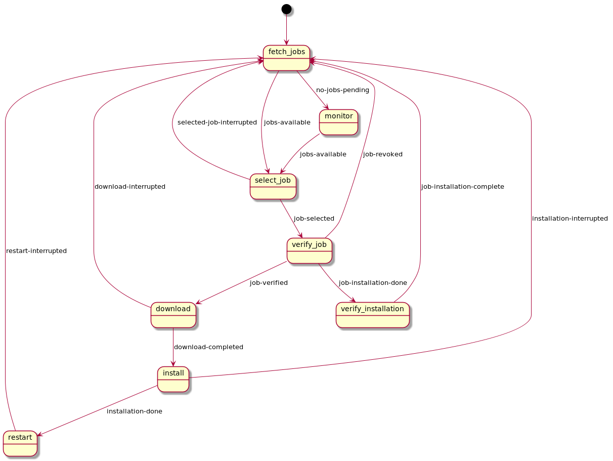

# Upparat [](https://buildkite.com/caru/upparat)

The _Upparat_ is a secure and robust service that runs on your
IoT device to download and install files such as firmware updates.

## How it works

The _Upparat_ subscribes to [AWS Iot Jobs](https://docs.aws.amazon.com/en_pv/iot/latest/developerguide/iot-jobs.html),
downloads and verifies the specified file and runs an installation command of your
choice. It handles all the nitty gritty details such as cancelled jobs,
failed downloads and progress updates.

Several hooks provide a seamless integration in your device environment and allow you
to use any software update tool such as [RAUC](https://github.com/rauc/rauc),
[SWUpdate](https://github.com/sbabic/swupdate) or a custom solution.

## Quickstart

[Have a look at our examples to get started](./misc/examples/README.md).

### Configuration

The following configuration options exist
(for a minimal configuration file consult the examples).

```ini
[service]
sentry_dsn = <sentry DSN>

# Default: WARNING
log_level = <DEBUG|INFO|WARNING|ERROR|EXCEPTION>

# Default: tmpdir
download_location = <path>

[broker]
# MQTT broker host / port
host = <host>
port = <port>

# Default: hostname
thing_name = <AWS thing name>

# Default: upparat
client_id = <local client id>

# Optional for client certifacte authentication
cafile = <Amazon root certificate>
certfile = <client certificate>
keyfile = <client priviate key>

[hooks]
# Used to compare against jobDoucment.version
version = <returns the currently installed version>
download = <checks if allowed to download>
install = <installs the downloaded file>
restart = <restarts your device/service>
ready = <checks if your system is stable / update succeeded>

# Hooks can return a status code 3 to indicate
# a retry at later time after retry_interval.
# Default: 60
retry_interval = <retry in seconds>

# Default: 60
# See retry_interval if hook has reached
# max_retries the job will be set to failed
max_retries = <max_retries>
```

### Start

`upparat -v -c <config>`

### Update

Create a job in the AWS Iot Console.

```json
{
  "action": "upparat-update",
  "version": "<test file version>",
  "file": "${aws:iot:s3-presigned-url:https://s3.<test file location>}",
  "meta": "<will be passed as an argument to your commands>",
  "force": false
}
```

### Hooks Examples

#### `version.sh`

```
#!/usr/bin/env bash
# $1: time elapsed since first call
# $2: retry count
# $3: meta from job document

# Gets the system version
cat /etc/bundle-version
```

#### `install.sh`

```
#!/usr/bin/env bash
# $1: time elapsed since first call
# $2: retry count
# $3: meta from job document
# $4: file location

# Example of the retry mechanism:
# Only install if a certain lock file is not present
if test -f /tmp/critical.lock; then
    exit 3
else
   rauc install $4
fi
```

## Development

- Create a virtualenv:

  ```
  python3 -m venv .venv
  . .venv/bin/activate
  ```

- Install Upparat in editable mode with development and optional sentry dependencies:

  ```
  pip install -e ".[dev,sentry]"
  ```

- Install the [pre-commit framework](https://pre-commit.com/#install).

- Install the pre-commit hooks:
  ```
  pre-commit install --install-hooks
  ```

### Tests

```bash
docker-compose run test
docker-compose run format
```

### Internal Statemachine


