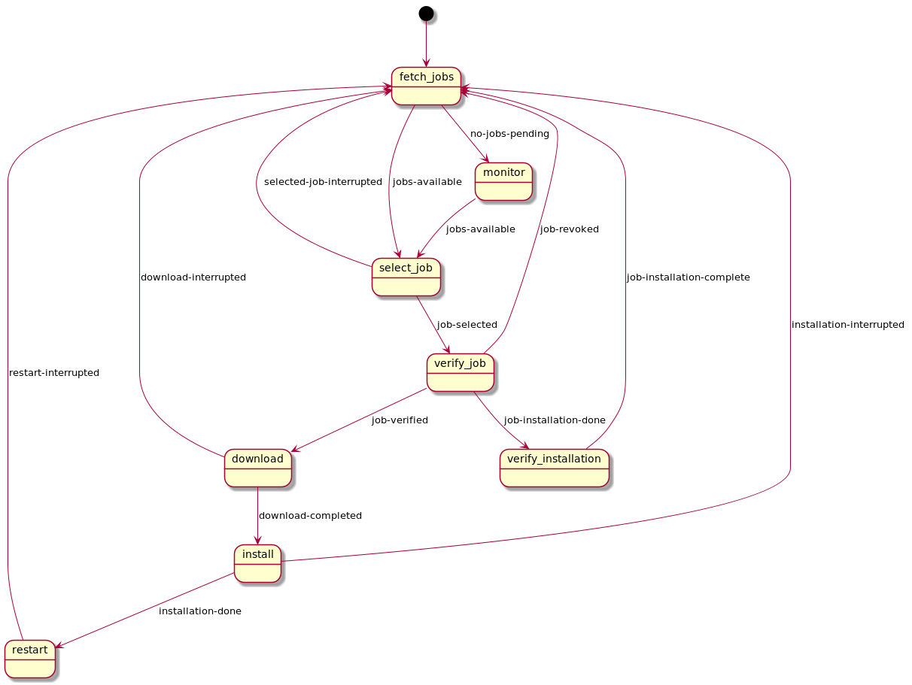

## Configuration Options

The following configuration options exist
(for a minimal configuration file consult the examples).

```ini
[service]
sentry_dsn = <sentry DSN>

# Default: WARNING
log_level = <DEBUG|INFO|WARNING|ERROR|EXCEPTION>

# Default: tmpdir
download_location = <path>

[broker]
# MQTT broker host / port
host = <host>
port = <port>

# Default: hostname
thing_name = <AWS thing name>

# Default: upparat
client_id = <local client id>

# Optional for client certifacte authentication
cafile = <Amazon root certificate>
certfile = <client certificate>
keyfile = <client priviate key>

[hooks]
# Mandatory hook:
# Expected to return installed version
# compared against jobDoucment.version
# if different => download and install
version = <returns the currently installed version>

# Optional: Hook to post-pone download
# on returncode 3, upparat will try again later.
download = <checks if allowed to download>

# Mandatory hook responsible for installation.
# on returncode 3, upparat will try again later.
install = <installs the downloaded file>

# Hook responsible for restart (of device or service)
# on returncode 3, upparat will try again later.
restart = <restarts your device/service>

# Expected to return 0 if device or service restart
# was successful. On returncode 3, upparat will try again later.
ready = <checks if your system is stable / update succeeded>

# Hooks can return code 3 to indicate a retry
# at later after retry_interval. Default: 60
retry_interval = <retry in seconds>

# See retry_interval if hook has reached max_retries
# the job will be set to failed. Default: 60
max_retries = <max_retries>
```

## Hooks

Hooks provide a way to integrate Upparat with any update system (i.e. RAUC, swupdate, etc.).

For a minimal setup you need to provide the following hooks:

- `install`: Handle the installation of the downloaded file.
- `reboot`: Handle the reboot of the device / service.

### List of all hooks with examples for RAUC

#### `version`

Return the currently installed version. Used to compare
with the provided version in the job, if equal update
is not considered necessary. Optional, if not specified
installation will always be executed.

```shell
#!/usr/bin/env bash
# $1: time elapsed since first call
# $2: retry count
# $3: meta from job document

cat /etc/version
```

#### `install`

Handle the installation of the downloaded file (`$4`).

```shell
#!/usr/bin/env bash
#
# $1: time elapsed since first call
# $2: retry count
# $3: meta from job document
# $4: file location

# Example of the retry mechanism:
# Only install if a certain lock file is not present
if test -f /tmp/critical.lock; then
    exit 3
else
   rauc install $4
fi
```

#### `download`

```shell
#!/usr/bin/env bash
#
# $1: timestamp from first call
# $2: retry count
# $3: meta from job document

# some condition, i.e. a lock file
# when we should wait with the download
if test -f /tmp/critical.lock; then
    exit 3
fi
```

#### `reboot`

```shell
#!/usr/bin/env bash

# $1: timestamp from first call
# $2: retry count
# $3: meta from job document

# some condition, i.e. a lock file
# when we should wait with the download

if test -f /tmp/critical.lock; then
    exit 3
fi
```

#### `ready`

```python

#!/usr/bin/env python3
"""
Test if the currently booted RAUC slot is marked as good.
"""
import json
import subprocess
import sys

MAX_RETRY_ATTEMPTS = 3

def main(args):

    rauc_status = subprocess.run(
        ["rauc", "status", "--output-format=json"],
        stdout=subprocess.PIPE,
        universal_newlines=True,
    )

    rauc_status_details = json.loads(rauc_status.stdout)
    booted_slot = rauc_status_details["booted"]

    # Get remaining attempts
    barebox_state = subprocess.run(
        ["sudo", "barebox-state", "-d"], stdout=subprocess.PIPE, universal_newlines=True
    )

    remaining_attempts_key = "bootstate.{}.remaining_attempts".format(booted_slot)
    remaining_attempts = 0
    for line in barebox_state.stdout.splitlines():
        key, value = line.split("=")
        if key == remaining_attempts_key:
            remaining_attempts = int(value)
            break

    # Signal retry if slot not (yet) marked as good
    if remaining_attempts != MAX_RETRY_ATTEMPTS:
        sys.exit(3)

if __name__ == "__main__":
    main(sys.argv[1:])

```

## Start

`upparat -v -c <config>`

## Systemd service & integration

```ini
[Unit]
Description=Upparat AWS IoT file installer
After=network-online.target
Wants=network-online.target

[Service]
Type=simple
ExecStart=/usr/local/bin/upparat -c /etc/upparat/upparat.conf
Environment=PYTHONUNBUFFERED=1
StandardOutput=journal

Restart=on-failure

[Install]
WantedBy=multi-user.target
```

## More Tooling

- [Upparat Job Creator](../misc/scripts/README.md)

## Statemachine


